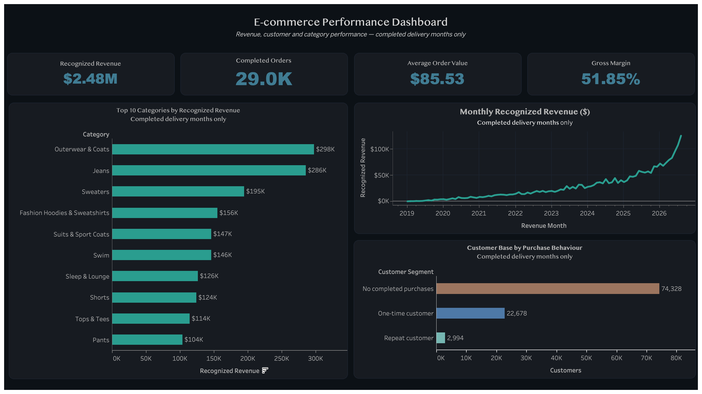

# E-commerce Analytics Dashboard

An end-to-end analytics portfolio project using BigQuery, GoogleSQL, Tableau, and GitHub. The project transforms raw e-commerce data into reporting views and presents the results through an interactive performance dashboard.

## Dashboard Preview



## Business Questions

This project explores:

- How has recognized revenue changed over time?
- How is revenue changing month over month and year over year?
- What do the rolling 3-month and 12-month revenue trends show?
- Which product categories generate the most revenue?
- Which individual products lead revenue and estimated gross profit?
- How many orders have been completed?
- What is the overall average order value?
- What is the estimated gross margin?
- How is the customer base divided by purchasing behaviour?

## Key Performance Indicators

- Recognized Revenue
- Completed Orders
- Average Order Value
- Gross Margin

The dashboard only includes completed delivery months, preventing incomplete current-month data from distorting the results.

## Deeper Insights SQL

The validated BigQuery views now include monthly revenue growth, customer
retention cohorts, product performance, and monthly order status. The current dashboard preview remains the original
performance dashboard; these newer views are ready for future Tableau pages.

- `monthly_revenue_growth`: monthly, yearly, and rolling revenue comparisons.
- `customer_retention_cohorts`: first-purchase cohorts and retention across
  elapsed months 0–12.
- `product_performance`: product-level revenue, estimated gross profit, margin,
  category rank, and contribution to revenue.
- `monthly_order_status`: current recorded status mix by order creation month,
  with explicitly defined cancellation and return shares.

## Dashboard Views

- Monthly recognized revenue trend
- Top 10 categories by recognized revenue
- Customer segmentation by purchase behaviour
- Executive KPI cards

## Tools and Technologies

- **BigQuery** — data exploration and reporting views
- **GoogleSQL** — transformation, aggregation, and validation
- **Tableau** — dashboard development and visualization
- **Git and GitHub** — version control and project documentation
- **VS Code** — SQL and repository management

## Repository Structure

```text
├── documentation/
│   ├── images/
│   │   └── ecommerce_performance_dashboard.png
│   ├── deeper_insights_audit.md
│   ├── metrics.md
│   ├── revenue_growth_validation.md
│   ├── customer_retention_notes.md
│   ├── product_category_notes.md
│   └── order_operations_notes.md
├── sql/
│   ├── 01_basic_queries.sql
│   ├── 02_orders_overview.sql
│   ├── 03_order_items_profile.sql
│   ├── 04_monthly_revenue.sql
│   ├── 05_category_performance.sql
│   ├── 06_customer_behavior.sql
│   ├── 07_create_reporting_views.sql
│   ├── 08_validate_reporting_views.sql
│   ├── 09_deeper_insights_data_audit.sql
│   ├── 10_monthly_revenue_growth.sql
│   ├── 11_validate_monthly_revenue_growth.sql
│   ├── 12_create_monthly_revenue_growth_view.sql
│   ├── 13_validate_monthly_revenue_growth_view.sql
│   ├── 14_customer_retention_foundation.sql
│   ├── 15_validate_first_customer_cohort_month.sql
│   ├── 16_customer_retention_cohorts.sql
│   ├── 17_validate_customer_retention_cohorts.sql
│   ├── 18_create_customer_retention_view.sql
│   ├── 19_validate_customer_retention_view.sql
│   ├── 20_product_category_foundation.sql
│   ├── 21_product_performance.sql
│   ├── 22_validate_product_performance.sql
│   ├── 23_create_product_performance_view.sql
│   ├── 24_validate_product_performance_view.sql
│   ├── 25_order_operations_foundation.sql
│   ├── 26_monthly_order_status_preview.sql
│   ├── 27_validate_monthly_order_status.sql
│   ├── 28_create_monthly_order_status_view.sql
│   └── 29_validate_monthly_order_status_view.sql
├── Tableau/
│   └── ecommerce_analytics_dashboard.twb
├── .gitignore
└── README.md
```

## Data Workflow

1. Explore the source tables in BigQuery.
2. Profile orders, order items, customers, and products.
3. Define the project metrics and business rules.
4. Create aggregated reporting views.
5. Validate totals across the reporting views.
6. Connect Tableau to the BigQuery views.
7. Build and format the final dashboard.

## Data Source

The project uses the public `bigquery-public-data.thelook_ecommerce` dataset.

Reporting views were created in:

```text
bigquery-analyst-practice.thelook_practice
```

## Metric Definitions

Detailed metric definitions and business rules are available in [`documentation/metrics.md`](documentation/metrics.md).

The source-data audit is recorded in [`documentation/deeper_insights_audit.md`](documentation/deeper_insights_audit.md), and the revenue-growth checks are recorded in [`documentation/revenue_growth_validation.md`](documentation/revenue_growth_validation.md).

Customer cohort definitions, the changing-source finding, and validation
results are recorded in
[`documentation/customer_retention_notes.md`](documentation/customer_retention_notes.md).

Product and category checks, modelling decisions, and deployment results are
recorded in [`documentation/product_category_notes.md`](documentation/product_category_notes.md).

## Tableau Workbook

The Tableau workbook is available at:

[`Tableau/ecommerce_analytics_dashboard.twb`](Tableau/ecommerce_analytics_dashboard.twb)

Because the workbook uses live BigQuery connections, users may need to authenticate with Google Cloud and update the connection details when opening it locally.

## Author

**Faisal Mughal**
